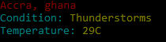

# weather
This js let us know The what is the temperature. It depends on the city and the country entered as parameters 

### how to use this code? 
write node cli.js (city) (country)
for example : 

`node cli.js Accra Ghana`

returns 

[Written By Melvin ADJEI](melvax/github.io)